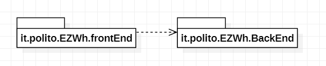
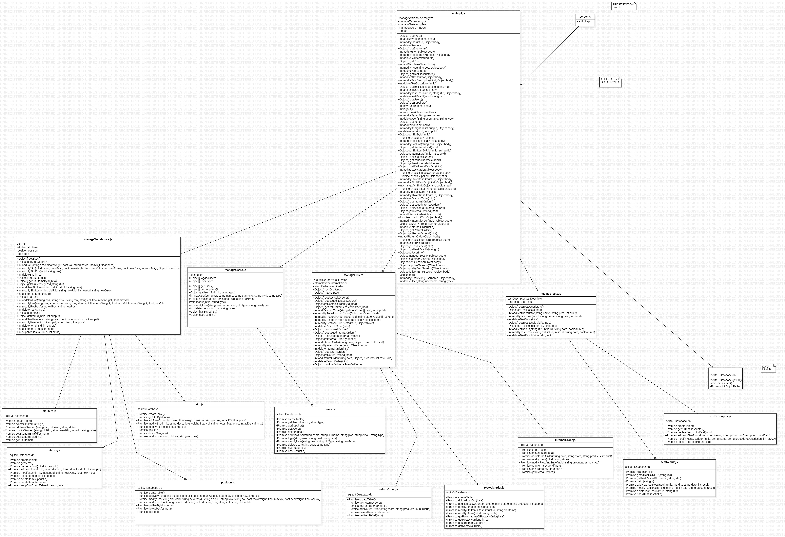

# Design Document

Authors: Mohamed Amine Hamdi, Francesco Calice, Juan Gonzalez Vazquez, Aditya Garg

Date: 24th April 2022

Version: 0.1

# Contents

- [Design Document](#design-document)
- [Contents](#contents)
- [Instructions](#instructions)
- [High level design](#high-level-design)
- [Low level design](#low-level-design)
- [Verification traceability matrix](#verification-traceability-matrix)
- [Verification sequence diagrams](#verification-sequence-diagrams)

# Instructions

The design must satisfy the Official Requirements document, notably functional and non functional requirements, and be consistent with the APIs

# High level design

From the official requirements we understand that we deploy a client server pattern, and then beyond that we decided that inside the server we want to use a layered pattern with 3 layers, this is done to decouple parts of our application and have the freedom to change a part of a program without having to modify everything, for example the gui usually changes a lot, pretty much everyday, so we need to avoid high coupling, the layers proposed are the one that follows:

-Presentation : this layer is the view of the user

-Application Logic : this layer provides the classes needed for the logic of our software

-Data : this layer provides the classes that contains the data that will be stored

This is the designed package diagram of our project:

The **it.polito.EZWh.frontEnd** package is the one that is provided to us containing the gui, while the **it.polito.EZWh.BackeEnd** package is the one that we'll develop that contains the APIs interface, the application logic and the data.

# Low level design

To implement the APIs interface we chose to exploit the structural facade pattern, so we don't have the need for the client to know how our system is composed internally and depend on each one of our modifications.

# Verification traceability matrix

| Function | Server | apiImpl | db   | ManageWarehouse | ManageUsers | ManageTests | ManageOrders | TestDescriptor | TestResult | User | SKUItem | SKU  | Position | Item | RestockOrder | ReturnOrder | InternalOrder |
| :------: | :----: | :-----: | :----: | :-------------: | :---------: | :---------: | :----------: | :------------: | :--------: | :--: | :-----: | :--: | :------: | :--: | :----------: | :---------: | :-----------: |
| **FR1**  |   X    |    X    | X |                 |      X      |             |              |                |            |  X   |         |      |          |      |              |             |               |
| **FR2**  |   X    |    X    | X |        X        |             |             |              |                |            |      |         |  X   |          |      |              |             |               |
| **FR3**  |   X    |    X    | X |        X        |             |      X      |              |       X        |     X      |      |         |      |    X     |      |              |             |               |
| **FR4**  |   X    |    X    | X |                 |      X      |             |              |                |            |  X   |         |      |          |      |              |             |               |
| **FR5**  |   X    |    X    | X |        X        |             |      X      |      X       |                |     X      |      |    X    |  X   |          |      |      X       |      X      |               |
| **FR6**  |   X    |    X    | X |        X        |             |             |      X       |                |            |      |    X    |  X   |          |      |              |             |       X       |
| **FR7**  |   X    |    X    | X |        X        |      X      |             |              |                |            |      |         |      |          |  X   |              |             |               |

# Verification sequence diagrams
\< 

>
