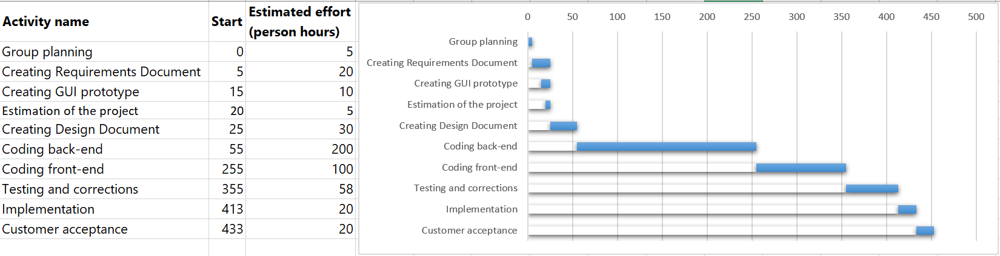

# Project Estimation  
Date: 12th April 2022

Version:

# Estimation approach
Consider the EZWH  project as described in YOUR requirement document, assume that you are going to develop the project INDEPENDENT of the deadlines of the course
# Estimate by size
### 
|             | Estimate                        |
| ----------- | ------------------------------- |
| NC =  Estimated number of classes to be developed   | 15 |
|  A = Estimated average size per class, in LOC       | 200 |
| S = Estimated size of project, in LOC (= NC * A) | 3000 |
| E = Estimated effort, in person hours (here use productivity 10 LOC per person hour)  | 300 |
| C = Estimated cost, in euro (here use 1 person hour cost = 30 euro) | 9000 |
| Estimated calendar time, in calendar weeks (Assume team of 4 people, 8 hours per day, 5 days per week ) | 1.875 |      

# Estimate by product decomposition
### 
|         component name    | Estimated effort (person hours)   |
| ----------- | ------------------------------- |
|requirement document    | 25 |
| GUI prototype |10|
|design document |40|
|code |300|
| unit tests |60|
| api tests |0|
| management documents  |30|

# Estimate by activity decomposition

| Activity name                  | Estimated effort (person hours) |
| ------------------------------ | ------------------------------- |
| Group planning                 | 5                               |
| Creating Requirements Document | 20                              |
| Creating GUI prototype         | 10                              |
| Estimation of the project      | 5                               |
| Creating Design Document       | 30                              |
| Coding back-end                | 200                             |
| Coding front-end               | 100                             |
| Testing and corrections        | 58                              |
| Implementation                 | 20                              |
| Customer acceptance            | 20                              |
| **Total**                      | 468                             |

 

# Summary

Report here the results of the three estimation approaches. The  estimates may differ. Discuss here the possible reasons for the difference
|             | Estimated effort                        |   Estimated duration |
| ----------- | ------------------------------- | ---------------|
| estimate by size |300|1.875|
| estimate by product decomposition |465|2.9|
| estimate by activity decomposition |368|2.3|
