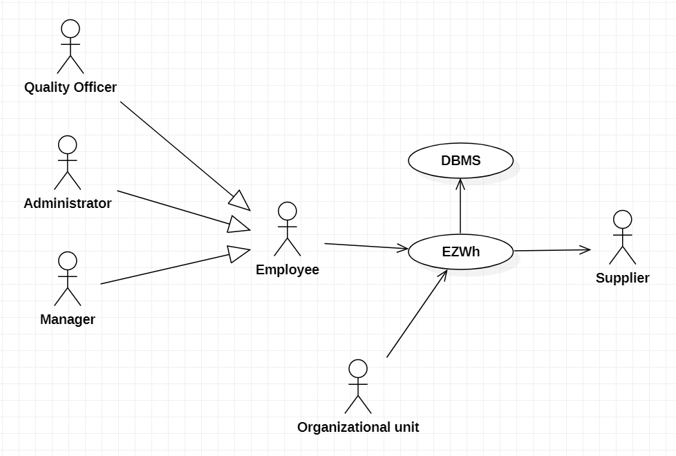
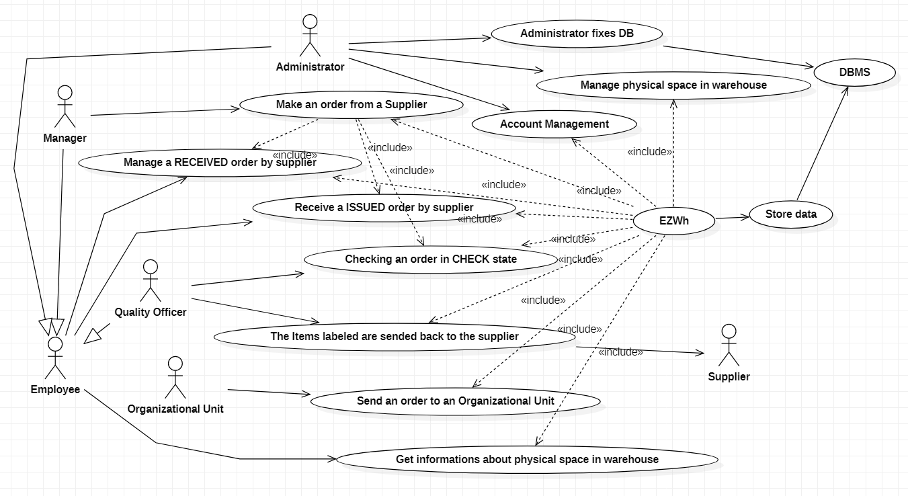
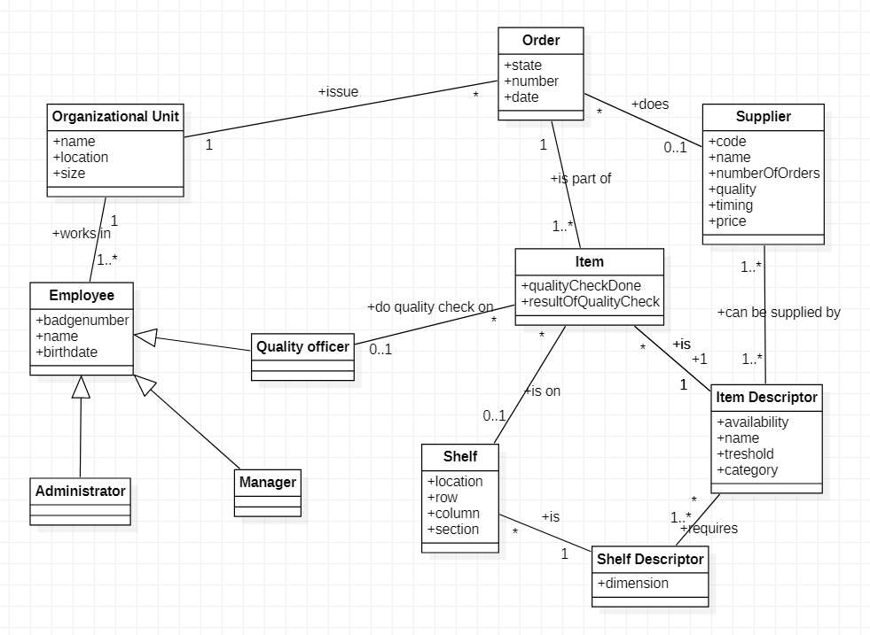
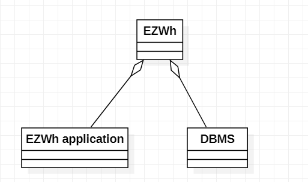
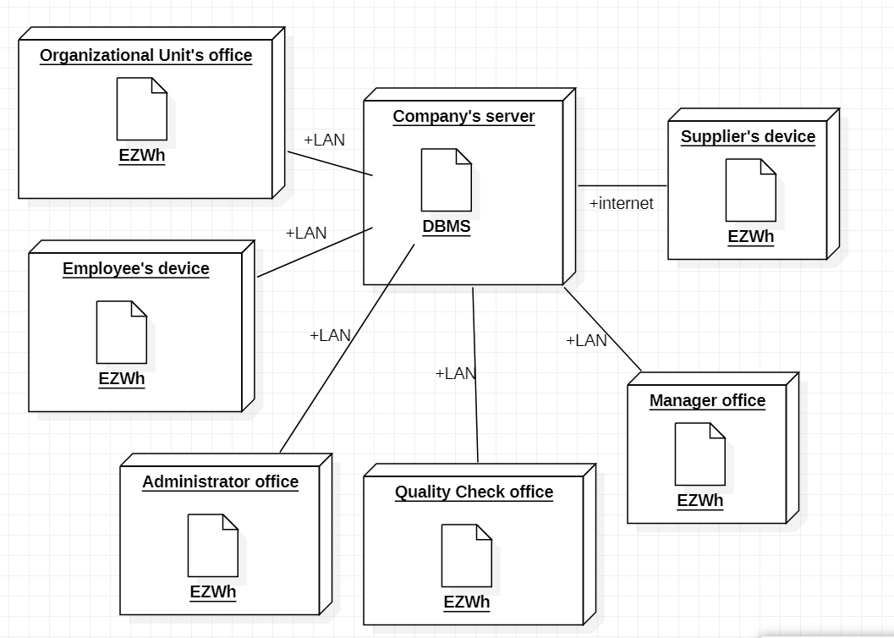

# Requirements Document - EZWH

Authors: Mohamed Amine Hamdi, Francesco Calice, Juan Gonzalez Vazquez, Aditya Garg

Date: 13th April 2022

| Version number | Change |
| ----------------- |:-----------|
| 0.1 | First Version |

# Contents

- [Informal description](#informal-description)
- [Stakeholders](#stakeholders)
- [Context Diagram and interfaces](#context-diagram-and-interfaces)
	+ [Context Diagram](#context-diagram)
	+ [Interfaces](#interfaces) 
	
- [Stories and personas](#stories-and-personas)
- [Functional and non functional requirements](#functional-and-non-functional-requirements)
	+ [Functional Requirements](#functional-requirements)
	+ [Non functional requirements](#non-functional-requirements)
- [Use case diagram and use cases](#use-case-diagram-and-use-cases)
	+ [Use case diagram](#use-case-diagram)
	+ [Use cases](#use-cases)
    	+ [Relevant scenarios](#relevant-scenarios)
- [Glossary](#glossary)
- [System design](#system-design)
- [Deployment diagram](#deployment-diagram)

# Informal description
Medium companies and retailers need a simple application to manage the relationship with suppliers and the inventory of physical items stocked in a physical warehouse. 
The warehouse is supervised by a manager, who supervises the availability of items. When a certain item is in short supply, the manager issues an order to a supplier. In general the same item can be purchased by many suppliers. The warehouse keeps a list of possible suppliers per item. 

After some time the items ordered to a supplier are received. The items must be quality checked and stored in specific positions in the warehouse. The quality check is performed by specific roles (quality office), who apply specific tests for item (different items are tested differently). Possibly the tests are not made at all, or made randomly on some of the items received. If an item does not pass a quality test it may be rejected and sent back to the supplier. 

Storage of items in the warehouse must take into account the availability of physical space in the warehouse. Further the position of items must be traced to guide later recollection of them.

The warehouse is part of a company. Other organizational units (OU) of the company may ask for items in the warehouse. This is implemented via internal orders, received by the warehouse. Upon reception of an internal order the warehouse must collect the requested item(s), prepare them and deliver them to a pick up area. When the item is collected by the other OU the internal order is completed. 

EZWH (EaSy WareHouse) is a software application to support the management of a warehouse.

# Stakeholders

| Stakeholder name     |                         Description                          |
| -------------------- | :----------------------------------------------------------: |
| Company or Retailer  | Company that buys our app, so they may have some say in how it's developed |
| Suppliers            |                   Sell and Send The items                    |
| Manager              |                     Supervise The items                      |
| Quality Office       |              Do the quality checks of the items              |
| Administrator        |                  Maintain The whole system                   |
| Employee             |            Manage The items and prepare the order            |
| Organizational Units |                 Order The items by warehouse                 |

# Context Diagram and interfaces

## Context Diagram

## Interfaces
| Actor                | Logical Interface | Physical Interface                         |
| -------------------- | :---------------: | ------------------------------------------ |
| Suppliers            |        GUI        | Screen, keyboard and mouse on PC           |
| Manager              |    GUI/console    | Screen, keyboard, and mouse on PC/keyboard |
| Quality Office       |        GUI        | Screen, keyboard and mouse on PC           |
| Administrator        |        GUI        | Screen, keyboard and mouse on PC           |
| Employee             |        GUI        | Screen, keyboard and mouse on PC           |
| Organizational Units |        GUI        | Screen, keyboard and mouse on PC           |

# Stories and personas
Persona 1: Juan, 50-year-old high income male.
Story: In rush, needs to find immediately the # of free shelves of a certain type to maximize an order. He needs a very easy and intuitive interface to be fast.

Persona 2: Ernesto, 25-year-old low-income employee.
Story: Needs to be as much productive as possible so he needs to find as fast as possible the closest group of # shelves type that are free to put the new items on place. Needs also to update the location info of each type of item.

Persona 3: Emilia, 25-year-old female, works for quality control
Story: Emilia has just ended her higher degree in electronics, and this is her first job. Emilia has a lot of energy and as a Millennial she is used to use applications. She needs to update the state of each item she inspects.

Persona 4: Roberto, 44-year-old male, in charge of buys department of its company.
Story: Roberto wants to buy at the lowest price a certain amount (normally big) and type of articles. He does not care from which provider he will get them. He is interested in low prices because he is a retailer. 

Persona 5: Steve, 58-year-old male, works for a renowed company.
Story: Steve´s company has high standards, that’s why he is interested in buying the highest quality items with the lowest delivery time, he makes few orders a month.

Persona 6: Francesca, 31-year-old female, responsible of sales management (supplier)
Story: Francesca wants to quickly check the order the supplier she works has received and the due date.  She is familiar with this kind of applications as she has worked on this sector for many years.

# Functional and non functional requirements

## Functional Requirements

| ID    |                         Description                          |
| ------------- | :-----------: |
| FR1   | Manage users and rights (users are Administrator, Manager, Organizational Unit, Employee, Quality Office) |
| FR1.1 |        Define a new user, or modify an existing user         |
| FR1.2 |                        Delete a user                         |
| FR1.3 | List all users |
| FR1.4 | Search a user |
| FR1.5 | Manage rights. Authorize access to functions to specific actors according to access rights |
| FR2   | Manage Items catalog |
| FR2.1 | Define a new item descriptor, or modify an existing item descriptor |
| FR2.2 | Delete an item descriptor |
| FR2.3 | List all item descriptor |
| FR2.4 | Search an item descriptor (by bar code, by description) |
| FR3   | Manage Warehouse |
| FR3.1 | Modify quantity available for an item descriptor |
| FR3.2 | Modify position for an item |
| FR3.3 | Define The space of warehouse (Physical Space) |
| FR3.4 | Modify The space of warehouse (Defining Specific Sectors) |
| FR4   | Manage suppliers |
| FR4.1 | Define new supplier |
| FR4.2 | Delete a supplier |
| FR4.3 | List all suppliers |
| FR4.4 | Search a supplier |
| FR4.5 | Issue an order to a supplier |
| FR4.6 | Attach a supplier to an item descriptor |
| FR5   | Quality Check |
| FR5.1 | Item Pass/Not Pass The check |
| FR5.2 | Label the item to send it back |
| FR6 | Manage orders |
| FR6.1 | List orders |
| FR6.2 | Add order (Internal, From a Supplier, To a supplier) |
| FR6.3 | Send an order for a product type |
| FR6.4 | Modify and check the state of the order(issued, received, delivered, check, completed) |

## Non Functional Requirements

| ID        | Type (efficiency, reliability, ..)           | Description  | Refers to |
| ------------- |:-------------:| :-----:| :----:|
|  NFR1     | Usability | Application should be used with no specific training for the users | All FR |
|  NFR2     | Performance | All functions should complete in < 1 sec | All FR |
|  NFR3     | Security | Access  to specific functions only to specific users | FR1, FR5 |
| NFR4 | Portability | Number of devices supported >1 | All FR |
| NFR5 | Maintainability | Max time to update the DB = 1 hour | All FR |
| NFR6 | Robustness | Time to restart after failure < 1 min | All FR |

# Use case diagram and use cases

## Use case diagram

### Use case 1, UC1 - Make an order from a Supplier

| Actors Involved  |                           Manager                            |
| ---------------- | :----------------------------------------------------------: |
| Precondition     | Items for a specific item descriptor are not available anymore in the warehouse, Supplier is in the list of suppliers |
| Post condition   | The order is in delivered state ready to be checked and stored |
| Nominal Scenario | Manager uses the app for ordering a certain amount of items of a specific item descriptor from a specific supplier |
| Variants         | the total volume of the items exceed the total volume available in the inventory, Issue warning |

##### Scenario 1.1

| Scenario       |             Items fit in the warehouse             |
| -------------- | :------------------------------------------------: |
| Precondition   | Manager M is logged in, Supplier S is in the list  |
| Post condition |             Order O is in ISSUED state             |
| Step#          |                    Description                     |
| 1              |                M confirms the order                |
| 2              | the total volume of the items fit in the inventory |
| 3              |           M marks O to be checked or not           |
| 4              |                  the O succeedes                   |
| 5              |           O is in the ISSUED state for M           |

##### Scenario 1.2

| Scenario       |              Items do not fit in the warehouse              |
| -------------- | :---------------------------------------------------------: |
| Precondition   |                                                             |
| Post condition |                                                             |
| Step#          |                         Description                         |
| 1              |                 Manager confirms the order                  |
| 2              | the total volume of the items does not fit in the inventory |
| 3              |                      the order failed                       |
| 4              |     Manager decrements the amout of items in the order      |
| 5              |                    repeat order process                     |

### Use case 2, UC2 - Account management

| Actors Involved  |                        Administrator                         |
| ---------------- | :----------------------------------------------------------: |
| Precondition     |       Employee does not exist in the Employee database       |
| Post condition   |                 Employee has his own profile                 |
| Nominal Scenario | Administrator uses the tool to register the employee inserting the required data (Name, Surname, ID Card, Username, Password, Role, Department) |
| Variants         |      Employee are uniquely identified by their ID Card       |

##### Scenario 2.1

| Scenario       |                      Account creation                      |
| -------------- | :--------------------------------------------------------: |
| Precondition   |                Employee or Supplier exists                 |
| Post condition |                     Account is created                     |
| Step#          |                        Description                         |
| 1              | Administrator gets the data about the employee or supplier |
| 2              |             Administrator creates the account              |

##### Scenario 2.2

| Scenario       |                      Account is updated                      |
| -------------- | :----------------------------------------------------------: |
| Precondition   |    Employee or Supplier had some changes(promotion etc.)     |
| Post condition |                      Account is updated                      |
| Step#          |                         Description                          |
| 1              |            Administrator gets the list of changes            |
| 2              | Administrator changes the accounts so the employee may have less or more rights now or the update was just for the data about the employee or supplier |

##### Scenario 2.3

| Scenario       |                      Account is deleted                      |
| -------------- | :----------------------------------------------------------: |
| Precondition   | Employee or supplier don't have anymore a relationship with the company |
| Post condition |                      Account is deleted                      |
| Step#          |                         Description                          |
| 1              | Administrator gets the list of fired employees and suppliers that doesn't exists anymore |
| 2              |           Administrator eliminates those accounts            |

### Use case 3, UC3 - Send an order to an Organizational Unit

| Actors Involved  |            Organizational Unit, Manager, Employee            |
| ---------------- | :----------------------------------------------------------: |
| Precondition     | Items of the order are available, OU is in the list, Manager is logged in |
| Post condition   |     Order (O) for Oragnizational Unit (OU) is completed      |
| Nominal Scenario | OU send an issue to do an order form the warehouse, an employee creates new order collecting all requested items. Manager Update the warehouse inventory and an Employee of the OU collects the order. |
| Variants         |  Creation of order, Item does not available, issue warning   |

##### Scenario 3.1

| Scenario       |                         Order issued                         |
| -------------- | :----------------------------------------------------------: |
| Precondition   |                       OU is logged in                        |
|                |            Manager of warehouse (M) is logged in             |
|                |                   All Items are available                    |
| Post condition |            Order O exists and is in ISSUED state             |
|                |                      Item.units changed                      |
| Step#          |                         Description                          |
| 1              |                   M recives an order by OU                   |
| 2              |                      M creates order O                       |
| 3              |  M remove from the DB the quantity and Items to be ordered   |
| 4              | O is recorded in the system in ISSUED state for both M and OU |

##### Scenario 3.2

| Scenario       |                   Order Delivered                   |
| -------------- | :-------------------------------------------------: |
| Precondition   |              Employee (E) is logged in              |
|                |           Order O in Issued state exists            |
| Post condition |            Order O is in DELIVERED state            |
| Step#          |                     Description                     |
| 1              |     E Collect the items and prepare the package     |
| 2              |       E puts the package in the pick up area        |
| 3              | O's state is updated to DELIVERED for both M and OU |

##### Scenario 3.3

| Scenario       |                   Order Completed                    |
| -------------- | :--------------------------------------------------: |
| Precondition   |         OU exists and has a DELIVERED order          |
|                |          M exists and has a DELIVERED order          |
|                |               O is in the pick up area               |
| Post condition |               O is in COMPLETED state                |
| Step#          |                     Description                      |
| 1              | E from OU collects the package from the pick up area |
| 2              |           E return to OU with the package            |
| 3              | O's state is updated to COMPLETED for both M and OU  |

### Use Case 4, UC4 - Receive a ISSUED order by a supplier

| Actors Involved  |                           Employee                           |
| ---------------- | :----------------------------------------------------------: |
| Precondition     |                Order O exists in ISSUED state                |
| Post condition   |                    O is in RECIVED state                     |
| Nominal Scenario | After a certain time an O arrives to the warehouse and an Employee manages it |
| Variants         |    The only orders collected are that exist in the system    |

##### Scenario 4.1

| Scenario       |                    Order arrives                     |
| -------------- | :--------------------------------------------------: |
| Precondition   |  Order O exists in ISSUED state, Employee logged in  |
| Post condition |                 O in RECEIVED state                  |
| Step#          |                     Description                      |
| 1              | The Employee collects the order by the delivery zone |
| 2              |   The Employee updates the state of O in RECEIVED    |

### Use Case 5, UC5 - Manage a RECEIVED order by a supplier

| Actors Involved  |                 Supplier, Employee, Manager                  |
| ---------------- | :----------------------------------------------------------: |
| Precondition     |               Order O exists in RECEIVED state               |
| Post condition   |             O is marked as COMPLETED/CHECK state             |
| Nominal Scenario | An Employee manages the order and update the state of the order |
| Variants         |     The only orders managed are that exist in the system     |

##### Scenario 5.1

| Scenario       |           Order to be checked           |
| -------------- | :-------------------------------------: |
| Precondition   |    Order O exists in RECEIVED state     |
|                |        O is marked to be checked        |
| Post condition |            O in CHECK state             |
| Step#          |               Description               |
| 1              |         The Employee collects O         |
| 2              | O is delivered to the Quality Office QO |
| 3              |       QO Update O in CHECK state        |

##### Senario 5.2

| Scenario       |                   Order not to be checked                    |
| -------------- | :----------------------------------------------------------: |
| Precondition   |                Order O exists in ISSUED state                |
|                |                 O isn't marked to be checked                 |
| Post condition |                     O in COMPLETED state                     |
| Step#          |                         Description                          |
| 1              |                   The Employee collects O                    |
| 2              | O is stored following the description of every Item in the warehouse |
| 3              | The Employee/Manager updates the state of the order to COMPLETED |

### Use Case 6, UC6 - Checking an Order in CHECK state

| Actor Involved   |                        Quality Office                        |
| ---------------- | :----------------------------------------------------------: |
| Precondition     |                Order O exists in CHECK state                 |
|                  |                 Quality Office is logged in                  |
| Post condition   |                     O in COMPLETED STATE                     |
|                  | The items that don't pass the quality check labeled to send back |
| Nominal Scenario | An Employee delivers the order to the quality office that check the items |
| Variants         | All items to be checked, only same items to be checked, no one item to be checked |

##### Scenario 6.1

| Scenario       |                     Item Pass the check                      |
| -------------- | :----------------------------------------------------------: |
| Precondition   | Order O is in CHECK state and delivered to Quality Office QO |
| Post condition |                        O is COMPLETED                        |
| Step#          |                         Description                          |
| 1              |      QO applies the specific check to the specific item      |
| 2              |                   The item pass the check                    |
| 3              |              The item is stored by an Employee               |
| 4              |   The Employee/Manager updates the space of the inventory    |
| 5              |                  Repeat 1-2-3 for all Items                  |
| 6              |                  O is updated to COMPLETED                   |

##### Scenario 6.2

| Scenario       |                 Item doesn't pass the check                  |
| -------------- | :----------------------------------------------------------: |
| Precondition   | Order O is in CHECK state and delivered to Quality Office QO |
| Post condition |                        O is COMPLETED                        |
|                |             Items are labeled to send them back              |
| Step#          |                         Description                          |
| 1              |      QO applies the specific check to the specific item      |
| 2              |               The item doesn't pass the check                |
| 3              |      The item is labeled to send back (Added in a List)      |
| 4              |                  Repeat 1-2-3 for all Items                  |
| 5              |                  O is updated to COMPLETED                   |

### Use Case 7, UC7 - The Items labeled are sended back to the supplier

| Actor Involved   |            Suppliers, Quality Office, Employee            |
| ---------------- | :-------------------------------------------------------: |
| Precondition     |            Same items are labeled to send back            |
|                  |                Quality Office is logged in                |
| Post condition   |           Items are sended back to the supplier           |
| Nominal Scenario | After the quality check the invalid items are sended back |
| Variants         |                                                           |

##### Scenario 7.1

| Scenario       |   Order O to send back the items is created    |
| -------------- | :--------------------------------------------: |
| Precondition   |   Items exist in a list of item to send back   |
| Post condition |            Order O in ISSUED state             |
| Step#          |                  Description                   |
| 1              |       Quality Office prepare the package       |
| 2              | Quality Office update the state of O in ISSUED |

##### Scenario 7.2

| Scenario      |               Order O is sended back                |
| ------------- | :-------------------------------------------------: |
| Precondition  |           Order O exists in ISSUED state            |
| Postcondition |                Order O is COMPLETED                 |
| Step#         |                     Description                     |
| 1             |           An Employee collects the order            |
| 2             |   The Employee get the order to the delivery zone   |
| 3             | The Employee/Manager updates the order to COMPLETED |

### Use Case 8, UC8 - Get informations about physical space in warehouse

| Actor Involved   |                           Employee                           |
| ---------------- | :----------------------------------------------------------: |
| Precondition     | The warehouse has already been mapped for the first time to get the size and the structure of it |
|                  |                   Employee E is logged in                    |
| Post condition   |            Items are sended back to the supplier             |
| Nominal Scenario | An employee wants to check the physical space of the warehouse |
| Variants         |                                                              |

##### Scenario 8.1

| Scenario       |     Employee finds n free shelves in the desired section     |
| -------------- | :----------------------------------------------------------: |
| Precondition   |         n free shelves exists in the desired section         |
| Post condition | Employee E gets the list of n free shelves in the section that are preferredly contiguous |
| Step#          |                         Description                          |
| 1              | Employee E select the desired section and the number of free shelves desired |
| 2              | If there are n free shelves in that section that are contiguous return that list of shelves |
| 3              |  else return the last set of n free shelves in that section  |

##### Scenario 8.2

| Scenario      | Employee doesn't find n free shelves in the desired section but they exists in another one |
| ------------- | :----------------------------------------------------------: |
| Precondition  | n free shelves in the desired section doesn't exists but they exists in another one |
| Postcondition | Employee E gets the list of n free shelves in the closest section to the one desired that are preferredly contiguous |
| Step#         |                         Description                          |
| 1             | Employee E select the desired section and the number of free shelves desired |
| 2             |          Find a section that has those free shelves          |
| 3             | Return the closest section to the one desired that has the free shelves |

##### Scenario 8.3

| Scenario      |      There aren't n free shelves in a section by itself      |
| ------------- | :----------------------------------------------------------: |
| Precondition  |         n free shelves doesn't exists in no section          |
| Postcondition | Employee E gets the list of n or n-k free shelves that are free and this list has shelves that are part of more sections |
| Step#         |                         Description                          |
| 1             | Employee E select the desired section and the number of free shelves desired |
| 2             | Find a section that has the most free shelves in the warehouse |
| 3             | If a close section to this has the amount left necessary for the employee return the list of shelves from both sections |
| 4             | Return the list of free shelves that reach n or less than n from multiple sections |

##### Scenario 8.4

| Scenario       |             Employee finds the desired item             |
| -------------- | :-----------------------------------------------------: |
| Precondition   |       specific item searched is in the warehouse        |
| Post condition |      Employee E gets the shelves where the item is      |
| Step#          |                       Description                       |
| 1              |           Employee E select the desired item            |
| 2              | return the list of shelves that hold that specific item |

##### Scenario 8.5

| Scenario       | Employee can't find the specific item but we have items in that category |
| -------------- | :----------------------------------------------------------: |
| Precondition   | specific item searched is not in the warehouse but items in that category are |
| Post condition | Employee E gets the set of available items in that category in the warehouse |
| Step#          |                         Description                          |
| 1              |              Employee E select the desired item              |
| 2              |   can't find the desired item so search for that category    |
| 3              | if there was no issue of reorder in the last week about that specific item do an issue of reorder |
| 3              | return the list of items that are in that category that are available in the warehouse |

##### Scenario 8.6

| Scenario       | Employee can't find the specific item and no items in that category are in the warehouse as well |
| -------------- | :----------------------------------------------------------: |
| Precondition   | specific item searched is not in the warehouse and also items in that category are not in the warehouse |
| Post condition |                                                              |
| Step#          |                         Description                          |
| 1              |              Employee E select the desired item              |
| 2              |   can't find the desired item so search for that category    |
| 3              | if there was no issue of reorder in the last week about that specific item do an issue of reorder |
| 3              |           repeat 3 for every item in that category           |

### Use Case 9, UC9 - Administrator fixes DB

| Actor Involved   |                      Administrator                      |
| ---------------- | :-----------------------------------------------------: |
| Precondition     |              a DB for the warehouse exists              |
|                  |               Administrator is logged in                |
| Post condition   |                      DB is working                      |
| Nominal Scenario | The Db has some issues but the administrator can fix it |
| Variants         |                                                         |

##### Scenario 9.1

| Scenario       |            DB has some issues but can be repaired            |
| -------------- | :----------------------------------------------------------: |
| Precondition   | DB has a backup copy in another server that is not corrupted and has a reliable log |
| Post condition |                 DB is not corrupted anymore                  |
| Step#          |                         Description                          |
| 1              |         The administrator gets a warning from the DB         |
| 2              | The administrator gets the last backup that is still working |
| 3              | The administrator reinstates the current DB with the log of the other cop |

### Use Case 10, UC10 - Manage physical space in warehouse

| Actor Involved   |                        Administrator                         |
| ---------------- | :----------------------------------------------------------: |
| Precondition     | The warehouse has already been mapped for the first time to get the size and the structure of it |
|                  |                 Administrator A is logged in                 |
| Post condition   |            Items are sended back to the supplier             |
| Nominal Scenario | The administrator needs to make some changes in the catalog or in the mapping of the warehouse |
| Variants         |                                                              |

##### Scenario 10.1

| Scenario       |                      warehouse mapping                       |
| -------------- | :----------------------------------------------------------: |
| Precondition   |    a file containing the mapping of the warehouse exists     |
| Post condition |                   the warehouse is mapped                    |
| Step#          |                         Description                          |
| 1              | Administrator uploads the file that represents our warehouse for our app |

##### Scenario 10.2

| Scenario      |             Insert an item or shelf descriptor              |
| ------------- | :---------------------------------------------------------: |
| Precondition  |                   an item or shelf exists                   |
| Postcondition |               item or shelf descriptor exists               |
| Step#         |                         Description                         |
| 1             | The administrator gets the data about the item or the shelf |
| 2             |            Administrator creates the descriptor             |

##### Scenario 10.3

| Scenario      |              Update an item or shelf descriptor              |
| ------------- | :----------------------------------------------------------: |
| Precondition  |              an item or shelf descriptor exists              |
| Postcondition |             item or shelf descriptor is updated              |
| Step#         |                         Description                          |
| 1             | The administrator gets the data changed about the item or the shelf |
| 2             |             Administrator updates the descriptor             |

##### Scenario 10.4

| Scenario      | Deletion of an item or shelf descriptor |
| ------------- | :-------------------------------------: |
| Precondition  |   an item or shelf descriptor exists    |
| Postcondition | item or shelf descriptor is eliminated  |
| Step#         |               Description               |
| 1             | Administrator eliminates the descriptor |

# Glossary

# System Design

# Deployment Diagram 

