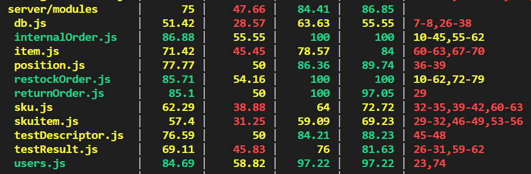

# Unit Testing Report

Date:

Version:

# Contents

- [Black Box Unit Tests](#black-box-unit-tests)

- [White Box Unit Tests](#white-box-unit-tests)

# Black Box Unit Tests

    <Define here criteria, predicates and the combination of predicates for each function of each class.
    Define test cases to cover all equivalence classes and boundary conditions.
    In the table, report the description of the black box test case and (traceability) the correspondence with the Jest test case writing the 
    class and method name that contains the test case>
    <Jest tests  must be in code/server/unit_test  >

 ### **Class *users* - method *addNewUser***

**Criteria for method *addNewUser*:**
	

 - type
 - password
 - email

**Predicates for method *addNewUser*:**

| Criteria | Predicate |
| -------- | --------- |
|   type       |   NOT NULL        |
|    password     |   NOT NULL        |
|    email      |    NOT NULL       |

**Boundaries**:

| Criteria | Boundary values |
| -------- | --------------- |
|    1      |    type!==null             |
|    2      |       pwd!==null          |
|   3   |   email!==null    |

**Combination of predicates**:

| Criteria 1 | Criteria 2 | Criteria 3 | Valid / Invalid | Description of the test case | Jest test case |
|-------|-------|-------|-------|-------|-------|
|NOT NULL|NOT NULL|NULL|INVALID|testing that the email exists|users.test.js|
|NOT NULL|NULL|NOT NULL|INVALID|testing that the password exists|users.test.js|
|NULL|NOT NULL|NOT NULL|INVALID|testing that the type exists|users.test.js|
|NOT NULL|NOT NULL|NOT NULL|VALID|accepting add of new user|users.test.js|

### **Class *testDescriptor* - method *getTestDescriptorById***

**Criteria for method *getTestDescriptorById*:**
	

 - id

**Predicates for method *getTestDescriptorById*:**

| Criteria | Predicate |
| -------- | --------- |
|   id       |   EXISTS IN DB        |

**Boundaries**:

| Criteria | Boundary values |
| -------- | --------------- |
|    1      |  (minInt,maxInt)             |

**Combination of predicates**:

| Criteria 1|Valid / Invalid | Description of the test case | Jest test case |
|-------|-------|-------|-------|
|IS NOT IN DB|INVALID|getting a test descriptor that doesn't exist->error 404|testDescriptor.test.js|
|IS IN DB|VALID|getting a test descriptor that exist|testDescriptor.test.js|

### **Class *internalOrder* - method *getOrdersInState***

**Criteria for method *getOrdersInState*:**
	

 - state

**Predicates for method *getOrdersInState*:**

| Criteria | Predicate |
| -------- | --------- |
|   state       |   NOT NULL        |

**Boundaries**:

| Criteria | Boundary values |
| -------- | --------------- |
|    1      |  state!==null            |
| 1         |  state is in one of the possible ones |

**Combination of predicates**:

| Criteria 1|Valid / Invalid | Description of the test case | Jest test case |
|-------|-------|-------|-------|
|NULL|INVALID|trying to get a list of internal orders in a null state->error 503|intOrd.test.js|
|NOT NULL BUT FAKE STATE|VALID|trying to get a list of internal orders in a non existant state, so receiving an empty array |intOrd.test.js|
|NOT NULL AND IN RIGHT STATE|VALID|trying to get a list of internal orders in a existant state, so receiving an array that can have some elements |intOrd.test.js|

# White Box Unit Tests

### Test cases definition
    
    
    <Report here all the created Jest test cases, and the units/classes under test >
    <For traceability write the class and method name that contains the test case>

| Unit name | Jest test case |
|--|--|
|users|users.test.js|
|testDescriptor|testDescriptor.test.js|
|skuitem|skuitem.test.js|
| sku  | sku.test.js  |
| item  | item.test.js  |
| testResult  | testResult.test.js  |
| internalOrder  | intOrd.test.js  |
| returnOrder   |   returnOrder.test.js |
| restockOrder  |   restockOrder.test.js |

### Code coverage report

    <Add here the screenshot report of the statement and branch coverage obtained using
    the coverage tool. >

### Loop coverage analysis

    <Identify significant loops in the units and reports the test cases
    developed to cover zero, one or multiple iterations >

|Unit name | Loop rows | Number of iterations | Jest test case |
|---|---|---|---|
|||||
|||||
||||||

